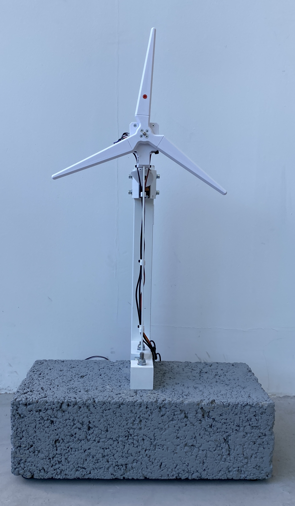
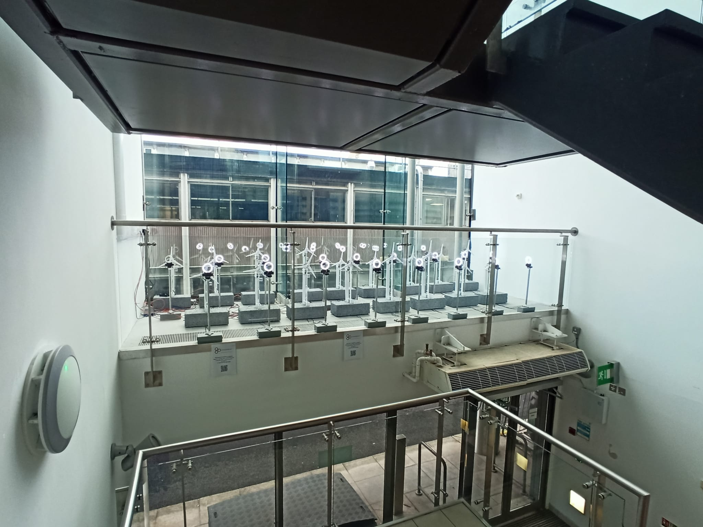

# dynamics lab

Dynamics experiment to investigate resonance of a mass-beam system. Free decay or driven oscillations can be measured. Frequency of driven oscillation can be controlled using a stepper motor and the uStepper s32 driver board. 

Initial prototype designed as part of an undergraduate student project in the School of Engineering, University of Edinburgh. That design was modified and implemented in this remote laboratory for the Structural Mechanics and Dynamics 3 course in the same department. The experiments are on public display in the School of Engineering:

If you are interested in adopting or designing a new remote laboratory based on this, or any, practable remote lab then please visit [www.practable.io](http://www.practable.io)

# Contents

Details of the hardware, firmware and UI can be found in the following directories:

- [fw](./fw/README.md)
- [hw](./hw/README.md)
- [ui](./ui/README.md)
- [sbc](./sbc/README.md)

# Activities

Describe possible activities that can be performed with this remote laboratory. This may include example activities for demonstrations or activities that connect with known learning objectives in undergraduate or secondary school courses.

## Version History

| Date | Version      | Update notes    |
| ------| ------------- | ------------- |
| September 2025 | v1.0           | Initial production release of dynamics lab |

