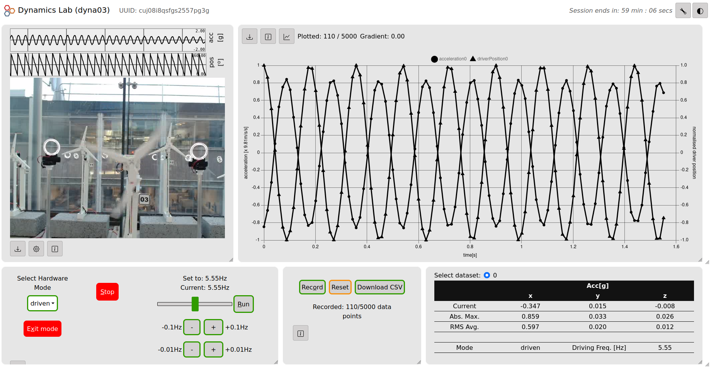

# user interface

The following user interfaces currently exist for the dynamics lab remote laboratory:

- [default](./default/) - default version of the user interface, with all features, but no logging of interactions.
- [analytics](./analytics/) - same as the default version + logging of interactions for analytics.



# Installation

- Clone this repo to your local machine.
- using the command line, move to the location of the tfla-dashboard i.e. `cd path/to/tfla-dashboard`

### Project setup

To install all the necessary packages included in `packages.json`:

```
npm install
```

### During development

Compiles and hot-reloads for development:

```
npm run dev
```

Go to the displayed URL.

### Build for production

Update the `.env.production` file to point `VITE_BASE` to the location where the UI will be hosted. Then run:

```
npm run build
```

And copy the files in the generated `dist` directory to the host location.

### Lints and fixes files
```
npm run lint
```